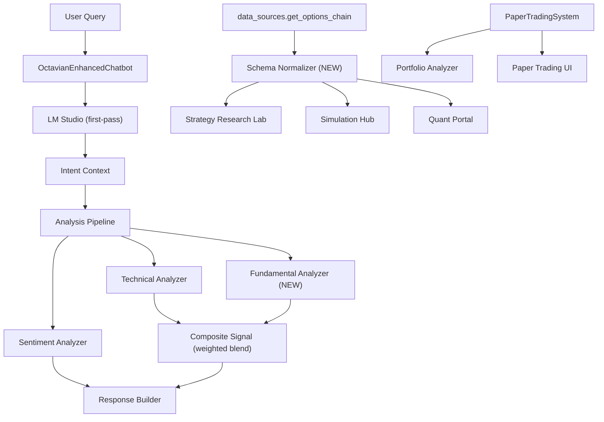

# Design Document: Trading Analysis Enhancements

## Overview

This document describes the technical design for eight enhancements to the Octavian trading/AI chatbot system. The changes span the analysis pipeline, options data handling, paper trading infrastructure, AI chatbot architecture, and portfolio analyzer UI. All enhancements are additive or corrective — no existing public interfaces are removed.

The system is a Streamlit-based Python application. The core chatbot is `OctavianEnhancedChatbot` in `ai_chatbot.py`. Market data flows through `data_sources.py`. The paper trading backend is `PaperTradingSystem` in `paper_trading_system.py`. The local LLM is accessed via `financial_llm_engine._call_llm` at `http://localhost:1234`.

---

## Architecture



---

## Components and Interfaces

### 1. FundamentalAnalyzer (new module: `fundamental_analyzer.py`)

Fetches and caches equity fundamental data via `yfinance`.

```python
class FundamentalAnalyzer:
    def get_fundamentals(self, symbol: str) -> Optional[FundamentalData]
    def _fetch_from_yfinance(self, symbol: str) -> Optional[FundamentalData]
    def _is_equity(self, symbol: str) -> bool
```

`FundamentalData` dataclass fields: `symbol`, `trailing_pe`, `forward_pe`, `eps_ttm`, `revenue_growth_yoy`, `profit_margin`, `debt_to_equity`, `qualitative_assessment`, `fetched_at`.

Cache: in-memory `dict[str, (FundamentalData, float)]` keyed by symbol, TTL 3600 s checked against `time.time()`.

`qualitative_assessment` derived from trailing P/E: `< 15` → "Undervalued", `15-25` → "Fairly Valued", `> 25` → "Overvalued".


### 2. Composite Signal Weighting (changes to `ai_chatbot.py`)

New helper `_get_analysis_weights(timeframe_scope, is_equity) -> (float, float)`:

| Condition | Fundamental weight | Technical weight |
|---|---|---|
| Non-equity (FX, futures, crypto) | 0.0 | 1.0 |
| SCALPING / INTRADAY | 0.20 | 0.80 |
| INVESTMENT | 0.75 | 0.25 |
| Default (all other) | 0.60 | 0.40 |

Composite score: `w_f * fundamental_score + w_t * technical_score` where both scores are normalised to `[0, 1]`.

### 3. Per-Asset Sentiment Analysis

New method `AdvancedNewsProcessor.analyze_symbol_sentiment(symbol: str, timeout: float = 10.0) -> SentimentResult`.

`SentimentResult` dataclass: `symbol`, `score: float` (range `[-1.0, 1.0]`), `label: str` (one of `VERY_BEARISH`, `BEARISH`, `NEUTRAL`, `BULLISH`, `VERY_BULLISH`), `article_count: int`, `top_headlines: List[str]` (max 3), `timed_out: bool`.

Credibility weighting: each article's sentiment score is multiplied by `SourceCredibilityEngine.get_credibility_score(source)` before averaging.

Divergence detection in `ai_chatbot.py`: if `abs(sentiment_score - technical_direction_score) > 0.4`, append a "Sentiment Divergence" warning block to the response.

### 4. Options Chain Schema Normalizer (changes to `data_sources.py`)

New function `normalize_options_chain(df: pd.DataFrame, symbol: str) -> pd.DataFrame`:

- Required columns and defaults: `vol` -> 0, `strike` -> 0, `lastPrice` -> 0, `bid` -> 0, `ask` -> 0, `impliedVolatility` -> 0.0, `openInterest` -> 0.
- For each missing column: fill with the default value and emit `logging.warning(f"vol column missing for {symbol}; defaulting to 0")`.
- Called inside `get_options_chain` before returning `opt.calls` / `opt.puts`.
- On total fetch failure: return `{'calls': pd.DataFrame(), 'puts': pd.DataFrame(), 'error': f"Options chain unavailable for {symbol}. Please try again later."}`.

### 5. Enhanced Options Features

**Strategy Research Lab (`strategy_research_lab.py`)**
- New "Options Strategy Builder" tab: wire up `OptionsEngine.get_strategy_pnl_map(legs)` for 10 strategy types. Display payoff chart, breakeven prices, max profit, max loss.
- IV Rank / IV Percentile: `iv_rank = (current_iv - min_iv_252) / (max_iv_252 - min_iv_252)`, `iv_percentile = percentileofscore(iv_history_252, current_iv)`.
- Volatility surface heatmap: call `OptionsEngine.generate_greek_surface(symbol, greek='iv')`.
- Greeks Dashboard: display Delta, Gamma, Theta, Vega, Rho, Vanna, Charm per leg and net totals.

**Simulation Hub (`market_simulation_engine.py`)**
- Monte Carlo P&L simulation: generate N=1000 GBM price paths, compute P&L at expiration for each path, display histogram.
- PoP = `count(paths where P&L > 0) / N`.

**Quant Portal (`quant_portal.py`)**
- "Derivative Intelligence" tab: render options chain table with columns: strike, expiry, type, bid, ask, lastPrice, volume, openInterest, IV, Delta, Gamma, Theta, Vega.
- Unusual activity scanner: flag rows where `volume > openInterest * 2`.
- Single contract detail: on row selection, show Greeks breakdown and single-leg payoff diagram.
- Put/Call Ratio: `sum(puts.volume) / sum(calls.volume)`.

### 6. Paper Trading Account Lookup Fix

`list_accounts`: change SQL `WHERE user_id = ?` to `WHERE LOWER(user_id) = LOWER(?)`.

`main.py` fix: replace `st.session_state.get('current_trader_id', 'trader_1')` with `st.session_state.get('current_trader_id') or st.session_state.get('username', 'default_user')`. Remove hardcoded `"trader_1"` fallback.

All `get_account` / `list_accounts` calls wrapped in try/except returning `None` / `[]` on `sqlite3.Error`.

### 7. LM Studio First-Pass Interpreter

New structured prompt sent to LM Studio before any other processing:

```
You are a financial query interpreter. Analyze the following user query and respond in JSON only:
{
  "intent": "<primary financial intent>",
  "symbols": ["<list of mentioned symbols>"],
  "timeframe": "<implied timeframe: scalping|intraday|swing|position|investment|general>",
  "analysis_type": "<technical|fundamental|sentiment|macro|options|general>"
}
Query: {user_query}
```

Parsing: `json.loads` on the response; on `JSONDecodeError` or empty response, fall back to existing regex detection.

`check_llm_connectivity()` called once at chatbot startup; result stored in `st.session_state['lm_studio_online']`. If `False`, display `st.info("LM Studio offline - using built-in analysis engine")` in sidebar (non-blocking).

Timeout: `requests.post(..., timeout=60)` already set in `_call_llm`. On `requests.Timeout`, log warning and proceed with regex fallback.

Intent preference: if LM Studio returns a non-empty `intent` and it differs from regex detection, use LM Studio's intent.

### 8. `datetime` Fix in Portfolio Analyzer

Audit all files in the portfolio analyzer module for bare `datetime` usage without import. Add `from datetime import datetime, timedelta` at the top of any file missing it. Wrap all render-time code in try/except to catch `NameError` / `ImportError` and display `st.error(...)` rather than a raw traceback.

### 9. Portfolio Import and Manual Entry (changes to `analytics_dashboard.py`)

New "Portfolio Analyzer" tab with two modes via `st.radio`:
- **Import**: `PaperTradingSystem.list_accounts(user_id)` -> selectbox -> `PaperTradingSystem.get_positions(account_id)` -> compute metrics.
- **Manual Entry**: `st.data_editor` with columns: symbol (str), quantity (float), entry_price (float), current_price (float, optional), asset_type (selectbox).

Metrics computed for both modes:
- `total_value = sum(qty * current_price)`
- `unrealized_pnl_per_position = (current_price - entry_price) * qty`
- `pct_return_per_position = unrealized_pnl / (entry_price * qty) * 100`
- `position_weight = (qty * current_price) / total_value * 100`

CSV export: `st.download_button` with `df.to_csv(index=False)`.

On import failure: `st.error(...)` and switch to manual entry mode.

On missing live price: use user-supplied `current_price` if provided; otherwise display "Price unavailable" and exclude from aggregate P&L.

---

## Data Models

### FundamentalData

```python
@dataclass
class FundamentalData:
    symbol: str
    trailing_pe: Optional[float]
    forward_pe: Optional[float]
    eps_ttm: Optional[float]
    revenue_growth_yoy: Optional[float]   # e.g. 0.12 = 12%
    profit_margin: Optional[float]
    debt_to_equity: Optional[float]
    qualitative_assessment: str           # "Undervalued" | "Fairly Valued" | "Overvalued"
    fetched_at: float                     # time.time() timestamp
```

### SentimentResult

```python
@dataclass
class SentimentResult:
    symbol: str
    score: float                          # [-1.0, 1.0]
    label: str                            # VERY_BEARISH | BEARISH | NEUTRAL | BULLISH | VERY_BULLISH
    article_count: int
    top_headlines: List[str]              # max 3
    timed_out: bool
```

### IntentContext (LM Studio parsed output)

```python
@dataclass
class IntentContext:
    intent: str
    symbols: List[str]
    timeframe: str
    analysis_type: str
    raw_narrative: str                    # full LM Studio response text
    parsed_ok: bool
```

### PortfolioPosition (for Portfolio Analyzer)

```python
@dataclass
class PortfolioPosition:
    symbol: str
    quantity: float
    entry_price: float
    current_price: Optional[float]
    asset_type: str                       # equity | option | crypto | fx
    unrealized_pnl: Optional[float]
    pct_return: Optional[float]
    weight: Optional[float]
```

---


## Correctness Properties

*A property is a characteristic or behavior that should hold true across all valid executions of a system - essentially, a formal statement about what the system should do. Properties serve as the bridge between human-readable specifications and machine-verifiable correctness guarantees.*

### Property 1: Fundamental data completeness

*For any* equity symbol for which `yfinance` returns non-null info, `FundamentalAnalyzer.get_fundamentals(symbol)` should return a `FundamentalData` object containing non-null values for all six required metrics (trailing_pe, forward_pe, eps_ttm, revenue_growth_yoy, profit_margin, debt_to_equity).

**Validates: Requirements 1.1**

### Property 2: Composite score weight correctness

*For any* equity symbol and any `TimeframeScope` value, the composite score produced by the analysis pipeline should equal `w_f * fundamental_score + w_t * technical_score` where `(w_f, w_t)` is the pair mandated by the scope: `(0.20, 0.80)` for SCALPING/INTRADAY, `(0.75, 0.25)` for INVESTMENT, `(0.60, 0.40)` for all other scopes, and `(0.0, 1.0)` for non-equity assets.

**Validates: Requirements 1.2, 1.3, 1.4, 1.5, 1.6**

### Property 3: Fundamental cache round-trip

*For any* equity symbol, calling `get_fundamentals` twice within 3600 seconds should return the same `FundamentalData` object (by value equality) without issuing a second network request.

**Validates: Requirements 1.8**

### Property 4: Sentiment score range invariant

*For any* symbol or text input, `SentimentResult.score` should be in the closed interval `[-1.0, 1.0]` and `SentimentResult.label` should be one of `{VERY_BEARISH, BEARISH, NEUTRAL, BULLISH, VERY_BULLISH}`.

**Validates: Requirements 2.2**

### Property 5: Credibility-weighted sentiment

*For any* set of articles with known credibility scores, the aggregate sentiment score produced by `analyze_symbol_sentiment` should equal the credibility-weighted average of individual article sentiment scores (not a simple average).

**Validates: Requirements 2.6**

### Property 6: Sentiment divergence detection

*For any* pair of `(technical_direction_score, sentiment_score)` where `abs(sentiment_score - technical_direction_score) > 0.4`, the chatbot response text should contain the string "Sentiment Divergence".

**Validates: Requirements 2.4**

### Property 7: Options chain schema normalization

*For any* raw options chain DataFrame (calls or puts) that is missing any subset of the required columns (`vol`, `strike`, `lastPrice`, `bid`, `ask`, `impliedVolatility`, `openInterest`), `normalize_options_chain` should return a DataFrame that contains all required columns, with missing numeric columns filled with 0, and should not raise a `KeyError`.

**Validates: Requirements 3.1, 3.2, 3.3**

### Property 8: Options chain consistent schema across providers

*For any* two raw DataFrames from different data providers (or different yfinance response shapes), `normalize_options_chain` applied to both should produce DataFrames with identical column sets.

**Validates: Requirements 3.4**

### Property 9: IV rank and percentile bounds

*For any* symbol with at least 252 trading days of IV history, the computed IV rank should be in `[0.0, 1.0]` and IV percentile should be in `[0.0, 100.0]`.

**Validates: Requirements 4.2**

### Property 10: Net portfolio Greeks additivity

*For any* multi-leg options strategy, the net portfolio Greek (Delta, Gamma, Theta, Vega, Rho, Vanna, Charm) should equal the sum of the corresponding Greek values across all individual legs.

**Validates: Requirements 4.4**

### Property 11: Unusual options activity scanner correctness

*For any* options chain DataFrame, the unusual activity scanner should flag exactly those rows where `volume > openInterest * 2` and should not flag any row where `volume <= openInterest * 2`.

**Validates: Requirements 4.8**

### Property 12: Put/Call ratio formula

*For any* options chain, the Put/Call Ratio metric should equal `sum(puts['volume']) / sum(calls['volume'])` (with a guard against division by zero).

**Validates: Requirements 4.10**

### Property 13: Paper trading account create-then-get round-trip

*For any* `user_id` and `account_name`, creating an account with `create_account(user_id, account_name)` and then calling `get_account(returned_account_id)` should return an account with the same `user_id`, `account_name`, and `initial_balance`.

**Validates: Requirements 5.1**

### Property 14: Case-insensitive account listing

*For any* `user_id` string, `list_accounts(user_id.upper())`, `list_accounts(user_id.lower())`, and `list_accounts(user_id)` should all return the same set of accounts.

**Validates: Requirements 5.2**

### Property 15: Database error resilience

*For any* database connection error during `get_account` or `list_accounts`, the method should return `None` or `[]` respectively and should not propagate the exception to the caller.

**Validates: Requirements 5.7**

### Property 16: LM Studio structured prompt completeness

*For any* user query string, the prompt sent to LM Studio should contain all four required instruction elements: intent identification, symbol extraction, timeframe identification, and analysis type suggestion.

**Validates: Requirements 6.2**

### Property 17: LM Studio intent context parse round-trip

*For any* valid JSON string containing `intent`, `symbols`, `timeframe`, and `analysis_type` fields, parsing it via the chatbot's LM Studio response parser should produce an `IntentContext` with `parsed_ok=True` and field values matching the JSON. For any empty or malformed string, `parsed_ok` should be `False` and the fallback regex detection should activate.

**Validates: Requirements 6.3**

### Property 18: LM Studio intent preference

*For any* query where LM Studio returns a non-empty, parseable `intent` that differs from the regex-detected intent, the intent used in the analysis pipeline should match the LM Studio intent.

**Validates: Requirements 6.7**

### Property 19: Portfolio analyzer render without NameError

*For any* call to any portfolio analyzer render function, no `NameError` related to `datetime` (or any other missing import) should be raised; all date construction calls should resolve successfully.

**Validates: Requirements 7.2, 7.3**

### Property 20: Portfolio metrics mathematical correctness

*For any* set of portfolio positions (whether imported from paper trading or manually entered), the computed metrics should satisfy:
- `total_value = sum(qty_i * price_i)`
- `unrealized_pnl_i = (price_i - entry_i) * qty_i`
- `pct_return_i = unrealized_pnl_i / (entry_i * qty_i) * 100`
- `weight_i = (qty_i * price_i) / total_value * 100`
- `sum(weight_i) = 100`

**Validates: Requirements 8.5, 8.6**

### Property 21: Portfolio CSV export round-trip

*For any* loaded portfolio (imported or manual), exporting to CSV and parsing the resulting CSV should produce a DataFrame with the same number of rows and the same symbol/quantity/entry_price values as the original portfolio.

**Validates: Requirements 8.7**

---

## Error Handling

| Scenario | Handling |
|---|---|
| `yfinance` returns no fundamental data | `get_fundamentals` returns `None`; chatbot falls back to 100% technical weight |
| Sentiment analysis timeout (> 10 s) | `SentimentResult.timed_out = True`; response notes "Sentiment data unavailable" |
| Options chain fetch fails entirely | Return empty DataFrames with user-readable error string |
| LM Studio offline at startup | Non-blocking `st.info` in sidebar; LM Studio calls skipped |
| LM Studio call timeout (> 60 s) | Log warning; proceed with regex intent detection |
| LM Studio returns malformed JSON | `parsed_ok = False`; fall back to regex detection |
| Paper trading DB connection error | Log error; return `None` / `[]`; do not propagate exception |
| Portfolio import failure | `st.error(...)` displayed; UI switches to Manual Entry mode |
| Live price fetch failure for manual entry | Use user-supplied price if provided; otherwise display "Price unavailable" and exclude from aggregate P&L |
| `datetime` NameError in portfolio analyzer | Caught by top-level try/except; `st.error(...)` displayed instead of raw traceback |

---

## Testing Strategy

### Dual Testing Approach

Both unit tests and property-based tests are required. Unit tests verify specific examples, edge cases, and integration points. Property-based tests verify universal correctness across randomized inputs. Together they provide comprehensive coverage.

### Unit Tests

Focus areas:
- `FundamentalAnalyzer.get_fundamentals` with mocked `yfinance` responses (valid equity, missing fields, non-equity symbol).
- `normalize_options_chain` with specific DataFrames missing known columns (including `vol`).
- `PaperTradingSystem.list_accounts` with `"trader_1"` vs `"default_user"` inputs.
- `_call_llm` timeout behavior with mocked `requests.post`.
- Portfolio metrics computation with a fixed set of positions.
- `check_llm_connectivity` with mocked HTTP responses (200 OK, connection refused).
- LM Studio offline startup: verify sidebar status indicator appears without crash.
- Paper trading UI initialization: verify `"default_user"` is used when session state has no `user_id`.

### Property-Based Tests

Library: **Hypothesis** (Python). Each property test runs a minimum of **100 iterations**.

Each test is tagged with a comment referencing the design property:

```python
# Feature: trading-analysis-enhancements, Property N: <property_text>
```

Each correctness property is implemented by a single property-based test.

| Property | Generator strategy |
|---|---|
| P2: Composite score weight correctness | Generate random `(fundamental_score, technical_score)` in `[0,1]` and random `TimeframeScope`; verify formula |
| P4: Sentiment score range invariant | Generate random article text; verify score in `[-1.0, 1.0]` and label in valid set |
| P5: Credibility-weighted sentiment | Generate random articles with random credibility scores; verify weighted average formula |
| P6: Sentiment divergence detection | Generate pairs where `abs(diff) > 0.4`; verify warning present in response |
| P7: Options chain schema normalization | Generate DataFrames with random subsets of required columns missing; verify no KeyError and all columns present with correct defaults |
| P8: Consistent schema across providers | Generate two DataFrames with different column subsets; verify normalized column sets are identical |
| P9: IV rank/percentile bounds | Generate random IV history arrays of length >= 252; verify bounds |
| P10: Net Greeks additivity | Generate random multi-leg strategies with random Greek values; verify net = sum of legs |
| P11: Unusual activity scanner | Generate options chain DataFrames with random volume/OI values; verify scanner flags exactly the right rows |
| P12: Put/Call ratio formula | Generate random call/put volume arrays; verify formula |
| P13: Account create-then-get | Generate random user_id and account_name strings; verify round-trip |
| P14: Case-insensitive listing | Generate random user_id strings; verify case variants return same accounts |
| P15: DB error resilience | Generate mock DB errors; verify return values are None/[] |
| P17: LM Studio parse round-trip | Generate random valid IntentContext dicts; serialize to JSON; verify parse produces matching IntentContext |
| P18: LM Studio intent preference | Generate pairs of (lm_intent, regex_intent) where they differ; verify LM Studio intent is used |
| P19: Portfolio render without NameError | Generate random portfolio states; call render functions; verify no NameError raised |
| P20: Portfolio metrics correctness | Generate random position sets with known prices; verify all metric formulas hold |
| P21: Portfolio CSV round-trip | Generate random portfolios; export to CSV; parse CSV; verify positions match |
